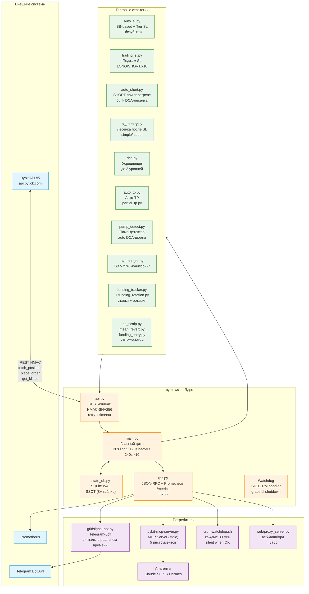
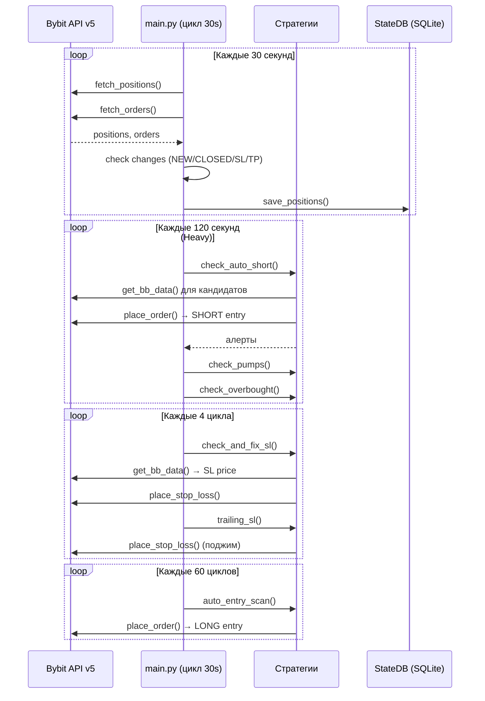
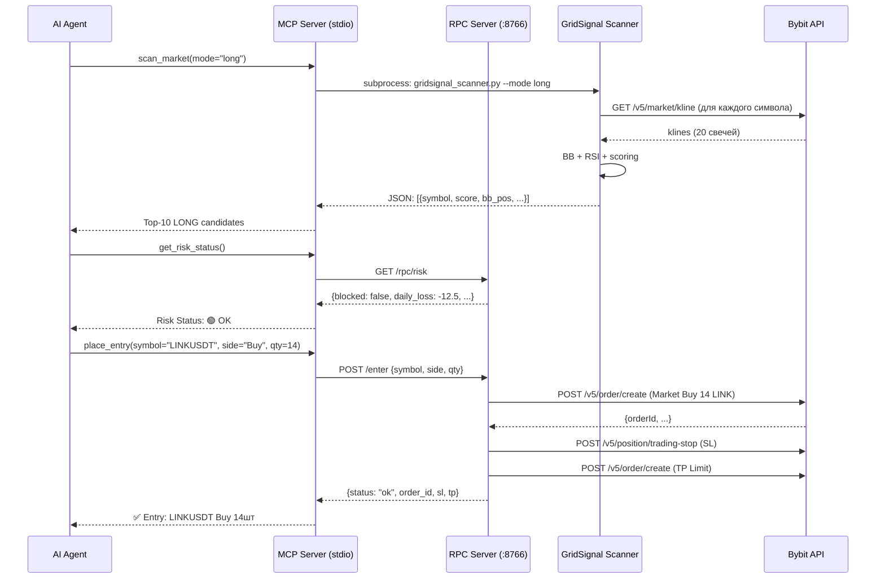
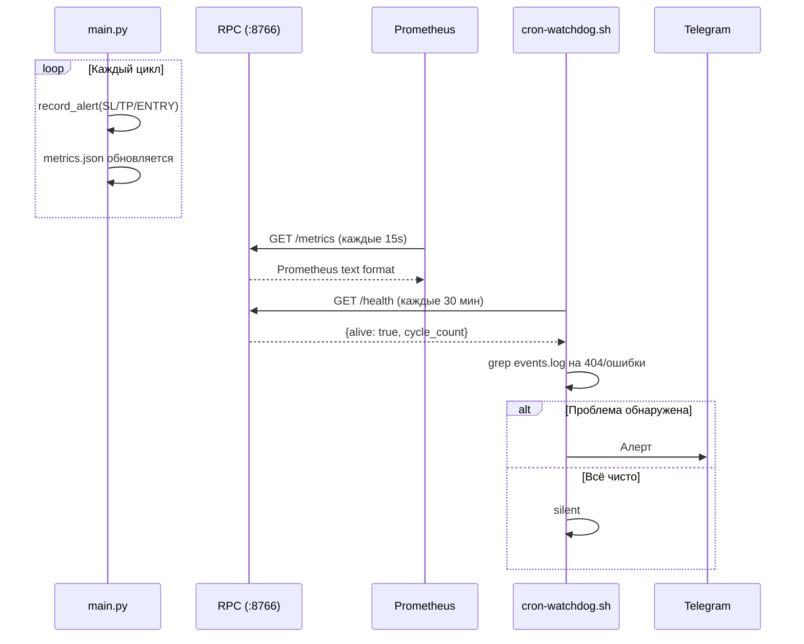
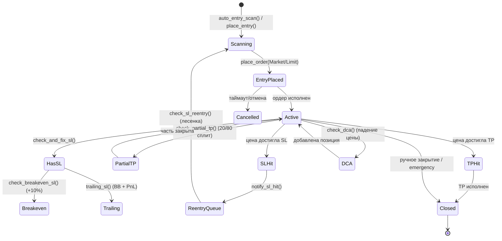
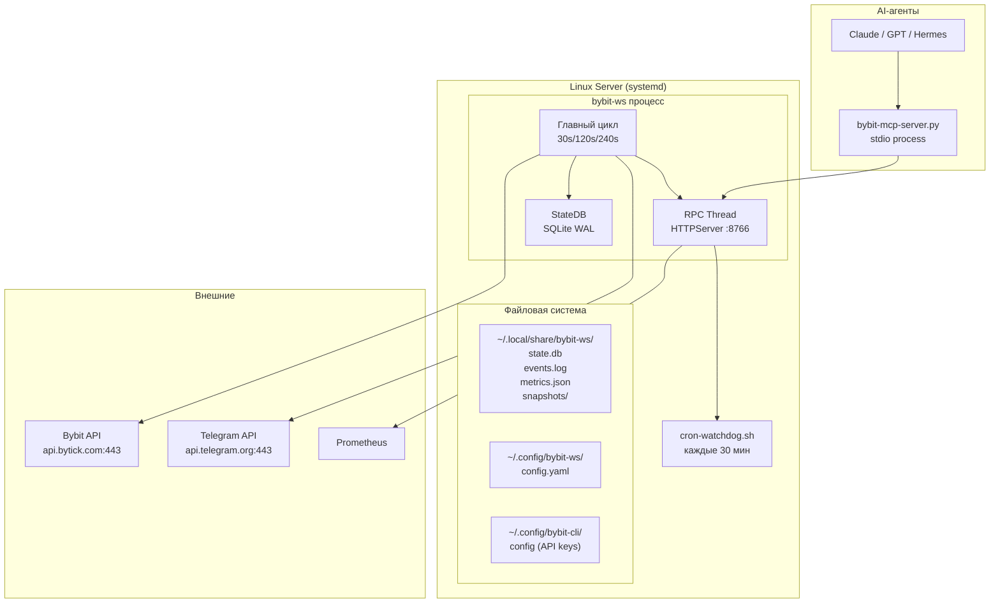

# ARCHITECTURE.md — bybit-ws

> Полная архитектурная документация: диаграммы, компоненты, потоки данных, модель данных, сетевая архитектура.
>
> **Версия:** 4.0 | **Дата:** 2026-06-18 | **Платформа:** Python 3.11+, Linux (systemd)

---

## 1. Обзорная архитектурная схема



### Ключевые принципы

| Принцип | Реализация |
|---------|------------|
| **SSOT** (Single Source of Truth) | SQLite `state.db` — единственный источник истины. JSON-файлы — резервные копии/кеши |
| **Graceful Degradation** | Каждая проверка обёрнута в `_timed_call()` с таймаутом 25s. Ошибка одного модуля не роняет весь цикл |
| **Defense in Depth** | SL → авто-безубыток → трейлинг → корреляционный стоп → risk-лимиты → watchdog |
| **Idempotency** | Все операции с ордерами идемпотентны (повторный вызов не создаёт дубликатов) |
| **Observability** | Prometheus /metrics, RPC /health, Telegram-алерты, events.log, журнал сделок |

---

## 2. Компоненты подробно

### 2.1 `main.py` — Главный цикл (1097 строк)

Точка входа и оркестратор. Запускается как systemd-сервис (`bybit-ws.service`).

#### Циклическая модель (3 уровня)

```
CYCLE_SECONDS = 30          # Базовый интервал
HEAVY_CYCLE = 4             # Тяжёлые проверки каждые 120s
TRAIL_CHECK_INTERVAL = 4    # Trailing SL каждые 120s
COVERAGE_CHECK_INTERVAL     # Сводка TP/SL раз в 4 часа
```

| Уровень | Интервал | Что делает |
|---------|----------|------------|
| **Лёгкий цикл** | 30s | `fetch_positions()`, `fetch_orders()`, детект изменений (NEW/CLOSED/REDUCE/SL_HIT/TP_HIT), алерты, снепшоты |
| **Тяжёлый цикл** (`_run_heavy_cycle`) | 120s | `check_regime`, `check_overbought`, `check_pumps`, `check_rsi_divergence`, `check_squeeze`, `check_correlation`, `check_auto_short`, `check_junk_dca`, `check_funding_flip`, `check_bb_squeeze`, `clean_stale_orders`, DCA, partial TP |
| **x10 цикл** (`_run_x10_cycle`) | 240s | `x10_entry_allowed`, `bb_scalp`, `mean_revert`, `funding_entry`, ATR-валидация, `x10_limits` |

#### Дополнительные проверки (между циклами)

| Интервал | Функция | Описание |
|----------|---------|----------|
| Каждые 4 цикла (120s) | `check_and_fix_sl()` | Авто-SL для позиций без стопа |
| Каждые 4 цикла (120s) | `check_breakeven_sl()` | SL → безубыток при +10% профита |
| Каждые 2 цикла (60s) | `check_expired_orders()` | Отмена просроченных ордеров |
| Каждые 4 цикла (120s) | `auto_take_profit()` | Авто-TP при достижении целей |
| Каждые 60 циклов (30 мин) | `auto_entry_scan()` | Авто-вход по сигналам |
| Каждые 120 циклов (1 час) | `check_daily_pnl_alert()` | Алерт по дневному PnL |
| Каждые 2 цикла | `get_alerts()` → `new_alerts.txt` | Алерты для внешнего монитора |

#### Функции безопасности

```python
def _run_safety_checks(new_positions, cfg, cycle_count, now_ts):
    """Проверки безопасности каждый цикл."""
    - check_liquidation(new_positions)      # Близость к ликвидации
    - check_daily_drawdown()                # Дневная просадка
    - _check_risk_limits(new_positions, cfg.risk)  # Лимиты маржи
    - check_margin_utilization()            # Утилизация маржи
```

#### Watchdog

```python
WATCHDOG_SECONDS = 300  # 5 минут

if now_wd - WATCHDOG_LAST > WATCHDOG_SECONDS:
    # Аварийный выход с сохранением снепшотов
    save_json(POSITIONS_SNAPSHOT, new_positions)
    save_json(ORDERS_SNAPSHOT, new_orders)
    sys.exit(1)
```

#### Graceful Shutdown (SIGTERM)

```python
signal.signal(signal.SIGTERM, handle_sigterm)

def handle_sigterm(signum, frame):
    # 1. Проверить SL на всех позициях
    check_and_fix_sl()
    check_breakeven_sl()
    # 2. Сохранить снепшоты позиций и ордеров
    save_json(POSITIONS_SNAPSHOT, new_positions)
    save_json(ORDERS_SNAPSHOT, new_orders)
    # 3. sys.exit(0)
```

#### `_timed_call()` — защита от зависаний

Каждая «тяжёлая» функция вызывается через `_timed_call(fn, timeout=25)` в отдельном потоке. Если функция не вернулась за 25 секунд — возвращается `([], fn_name)` и цикл продолжается.

---

### 2.2 `api.py` — REST-клиент к Bybit v5 (472 строки)

Низкоуровневый слой взаимодействия с биржей. **Полная замена** subprocess-вызовов `bybit-cli` (v3.0, код-ревью 14.06.2026).

#### Архитектура

```
api.py
├── _load_credentials()       # Чтение ~/.config/bybit-cli/config
├── _get_session()             # requests.Session (connection reuse)
├── _sign_request()            # HMAC-SHA256 подпись
├── _auth_headers()            # X-BAPI-* заголовки
├── bybit()                    # Универсальный запрос с retry
├── fetch_positions()          # GET /v5/position/list
├── fetch_orders()             # GET /v5/order/realtime (пагинация)
├── place_stop_loss()          # POST /v5/position/trading-stop
├── place_take_profit()        # POST /v5/order/create (Limit, reduceOnly)
├── cancel_order()             # POST /v5/order/cancel
├── get_bb_lower()             # GET /v5/market/kline → Bollinger Lower
├── get_bb_data()              # GET /v5/market/kline → full BB (lower, middle, upper, bb_pos)
├── fetch_funding_total()      # GET /v5/account/transaction-log (пагинация)
├── fetch_atr()                # GET /v5/market/kline → ATR (Wilder's smoothing)
└── place_order()              # POST /v5/order/create (универсальный)
```

#### HMAC-подпись

```
sign_str = timestamp + API_KEY + recv_window + body_str
sign = HMAC-SHA256(API_SECRET, sign_str)
```

Заголовки:
```
X-BAPI-API-KEY: <key>
X-BAPI-TIMESTAMP: <ms>
X-BAPI-RECV-WINDOW: 5000
X-BAPI-SIGN: <hex>
```

#### Retry-логика

| Ошибка | Стратегия |
|--------|----------|
| HTTP 404 | **Немедленный возврат None** (эндпоинт не существует, повтор бесполезен) |
| HTTP 429 | Экспоненциальный backoff: 1s → 2s → 4s → ... → 16s |
| HTTP 500/503/504 | Линейные задержки: 1s → 3s → 5s |
| Timeout (15s) | Повтор с линейными задержками |
| ConnectionError | Повтор с линейными задержками |
| JSONDecodeError | Повтор с линейными задержками |

Максимум попыток: `MAX_RETRIES = 3`.

#### Session (connection reuse)

```python
_session = requests.Session()
_session.headers.update({
    'Content-Type': 'application/json',
    'User-Agent': 'bybit-ws/4.0',
})
```

Одна сессия на всё время жизни процесса. Переиспользование TCP-соединений даёт ускорение 10–50× по сравнению с subprocess.

#### Используемые эндпоинты Bybit v5

| Метод | Путь | Назначение |
|-------|------|------------|
| GET | `/v5/position/list?category=linear&settleCoin=USDT` | Открытые позиции |
| GET | `/v5/order/realtime?category=linear&settleCoin=USDT&limit=50` | Активные ордера (с пагинацией) |
| POST | `/v5/position/trading-stop` | Установка SL |
| POST | `/v5/order/create` | Создание ордера (TP, вход, limit) |
| POST | `/v5/order/cancel` | Отмена ордера |
| GET | `/v5/market/kline?category=linear&symbol=X&interval=D&limit=20` | Свечи для BB |
| GET | `/v5/market/tickers?category=linear` | Тикеры (фандинг) |
| GET | `/v5/account/transaction-log?type=FUNDING` | История фандинга |
| GET | `/v5/account/wallet-balance?accountType=UNIFIED&coin=USDT` | Баланс |
| GET | `/v5/market/instruments-info?category=linear&symbol=X` | Информация о символе |

---

### 2.3 `state_db.py` — SQLite SSOT (390 строк)

Центральное хранилище. **Замена 15+ JSON-файлов** на одну транзакционную базу.

#### Принципы

- **WAL-режим** (Write-Ahead Log): читатели не блокируют писателей
- **synchronous=NORMAL**: баланс между скоростью и надёжностью
- **busy_timeout=5000ms**: автоматическое ожидание при блокировках
- **Ленивое подключение**: `conn` создаётся при первом обращении
- **Однопоточность**: `check_same_thread=False`, но фактически один поток (главный цикл)

#### Схема базы данных (8 таблиц + kv_store)

```sql
-- Аудит закрытых сделок
CREATE TABLE trade_history (
    id INTEGER PRIMARY KEY AUTOINCREMENT,
    symbol TEXT NOT NULL,
    side TEXT NOT NULL,            -- Buy/Sell
    strategy TEXT,                 -- GRID_LONG, SHORT, JUNK_SHORT, x10:scalp, ...
    entry_price REAL,
    exit_price REAL,
    size REAL,
    pnl REAL,
    fees REAL DEFAULT 0,
    entry_at INTEGER,              -- Unix timestamp
    closed_at INTEGER
);
CREATE INDEX idx_trade_symbol ON trade_history(symbol);
CREATE INDEX idx_trade_closed ON trade_history(closed_at);

-- Кеш открытых позиций (замена positions.json)
CREATE TABLE positions (
    symbol TEXT PRIMARY KEY,
    side TEXT,
    entry REAL,
    mark REAL,
    size REAL,
    leverage REAL,
    stop_loss REAL,
    take_profit REAL,
    position_idx INTEGER DEFAULT 0,
    upnl REAL DEFAULT 0,
    liq_price REAL,
    updated_at INTEGER
);

-- Состояние автошорта (замена short_positions.json)
CREATE TABLE short_state (
    symbol TEXT PRIMARY KEY,
    last_short_ts INTEGER,
    entry_price REAL,
    qty REAL,
    bb_pct REAL,                  -- BB позиция при входе
    is_junk INTEGER DEFAULT 0,    -- 1 = Tier C/D (junk)
    dca_level INTEGER DEFAULT 0,  -- текущий уровень DCA (0,1,2)
    state_json TEXT               -- полный JSON-слепок
);

-- Трекинг пампов (замена pumps.json)
CREATE TABLE pump_state (
    symbol TEXT PRIMARY KEY,
    first_seen_ts INTEGER,
    peak_price REAL,
    alerts_json TEXT,             -- JSON-массив алертов
    daily_pump INTEGER DEFAULT 0, -- 1 = daily pump
    weekly_pump INTEGER DEFAULT 0,-- 1 = weekly pump
    short_entry_ts INTEGER,       -- время входа в пампа-шорт
    manual INTEGER DEFAULT 0,     -- 1 = ручной вход
    state_json TEXT
);

-- Дневной лимит x10 убытков
CREATE TABLE x10_limits (
    date TEXT NOT NULL,
    strategy TEXT NOT NULL,       -- scalp, mean_revert, funding
    losses INTEGER DEFAULT 0,     -- кол-во убыточных сделок
    pnl REAL DEFAULT 0,
    stopped_at INTEGER,           -- когда сработал стоп
    PRIMARY KEY (date, strategy)
);

-- Трекинг x10 позиций
CREATE TABLE x10_positions (
    symbol TEXT PRIMARY KEY,
    strategy TEXT,                -- scalp/mean_revert/funding
    entry_price REAL,
    size REAL,
    opened_at INTEGER,
    state_json TEXT
);

-- Кулдауны (SL/TP/входы)
CREATE TABLE cooldowns (
    key TEXT PRIMARY KEY,         -- "sl:SYMBOL", "tp:SYMBOL", "entry:SYMBOL"
    until INTEGER                 -- Unix timestamp окончания
);

-- Дедупликация алертов
CREATE TABLE alert_dedup (
    key TEXT PRIMARY KEY,         -- хеш сообщения
    last_at INTEGER
);

-- Key-Value хранилище (конфиг, токены, состояние)
CREATE TABLE kv_store (
    key TEXT PRIMARY KEY,
    value TEXT                    -- JSON-строка
);
```

#### Ключевые методы

```python
class StateDB:
    # trade_history
    def add_trade(symbol, side, strategy, entry_price, exit_price, size, pnl, fees, ...)
    def get_trades(symbol=None, since=None, limit=100)
    def get_pnl_summary(since=None) -> {total_pnl, total_fees, trades}

    # positions
    def save_positions(positions_dict)
    def get_positions() -> dict

    # short_state
    def save_short_state(symbol, data)
    def get_short_state(symbol=None) -> dict | None
    def get_all_short_state() -> dict

    # pump_state
    def save_pump_state(symbol, data)
    def get_pump_state(symbol=None) -> dict
    def get_all_pump_state() -> dict

    # x10
    def save_x10_limits(date, strategy, data)
    def get_x10_limits() -> dict
    def save_x10_position(symbol, data)
    def get_x10_positions() -> dict
    def remove_x10_position(symbol)

    # cooldowns
    def set_cooldown(key, seconds)
    def is_cooling_down(key) -> bool
    def get_cooldown_remaining(key) -> int
    def clear_cooldown(key)
    def clean_expired_cooldowns()

    # alert_dedup
    def should_alert(key, cooldown_seconds) -> bool
    def clean_old_alerts(max_age=86400)

    # kv_store
    def set_kv(key, value)
    def get_kv(key, default=None)

    # maintenance
    def vacuum()
    def close()
```

---

### 2.4 `rpc.py` — JSON-RPC сервер (1044 строки)

HTTP-сервер на `http.server.HTTPServer`, запускается в фоновом потоке.

#### Конфигурация

| Параметр | Значение |
|----------|----------|
| Порт | `8766` |
| Bind | `127.0.0.1` (только localhost) |
| API Version | `v1` |
| Auth | Bearer UUID-токен (обязателен всегда) |
| Rate Limit | 60 запросов/мин/IP (token bucket) |
| CORS | `http://localhost, http://127.0.0.1` |

#### Эндпоинты

##### Публичные (без авторизации)

| Метод | Путь | Ответ |
|-------|------|-------|
| GET | `/health` | `{"alive": true, "started_at": ..., "cycle_count": 123, "paused": false}` |
| GET | `/rpc/paths` | Все пути установки: state_db, events_log, config_file, repo и т.д. |

##### Защищённые (Bearer-токен обязателен)

| Метод | Путь | Описание |
|-------|------|----------|
| GET | `/rpc/all` | Все данные одним запросом |
| GET | `/rpc/positions` | Открытые позиции |
| GET | `/rpc/orders` | Активные ордера |
| GET | `/rpc/trades` | Трейд-лог |
| GET | `/rpc/alerts` | Последние алерты |
| GET | `/rpc/metrics` | Дневные метрики (JSON) |
| GET | `/rpc/risk` | Риск-статус (margin, daily loss) |
| GET | `/rpc/signals` | Сигналы LONG + SHORT |
| GET | `/rpc/config` | Конфигурация (без секретов) |
| GET | `/metrics` | **Prometheus** формат |
| POST | `/scan` | Запуск GridSignal-сканера |
| POST | `/enter` | Ручной вход в позицию |
| POST | `/close` | Закрыть позицию |
| POST | `/reset-token` | Сброс RPC-токена |

##### Алиасы (короткие пути)

`/positions`, `/orders`, `/metrics`, `/risk`, `/signals`, `/config`, `/balance`

#### Prometheus /metrics

```
# HELP bybit_ws_active_positions Current number of active positions
# TYPE bybit_ws_active_positions gauge
bybit_ws_active_positions 7

# HELP bybit_ws_daily_pnl Realized PnL today
# TYPE bybit_ws_daily_pnl gauge
bybit_ws_daily_pnl 23.45

# HELP bybit_ws_cycle_duration_seconds Last cycle duration
# TYPE bybit_ws_cycle_duration_seconds gauge
bybit_ws_cycle_duration_seconds 2.1
```

#### RPC Error Codes (MONITOR.md §5)

| HTTP | error_code | Описание |
|------|-----------|----------|
| 400 | `bad_request` | Некорректный запрос |
| 401 | `unauthorized` | Неверный или отсутствующий токен |
| 402 | `insufficient_margin` | Недостаточно маржи |
| 404 | `symbol_not_found` | Символ не найден |
| 409 | `position_exists` | Позиция уже существует |
| 422 | `invalid_qty` | Некорректное количество |
| 429 | `rate_limit` | Превышен лимит запросов |
| 500 | `internal_error` | Внутренняя ошибка |

#### Аутентификация

Токен генерируется при первом запуске (UUID v4), сохраняется в `state.db → kv_store → rpc_auth_token`. При отсутствии читается из `config.yaml → rpc.auth_token`.

```bash
# Получить токен
python3 -c "import sqlite3; c=sqlite3.connect('$HOME/.local/share/bybit-ws/state.db'); print(c.execute(\"SELECT value FROM kv_store WHERE key='rpc_auth_token'\").fetchone()[0])"

# Использовать
curl -H "Authorization: Bearer <token>" http://127.0.0.1:8766/rpc/positions
```

---

### 2.5 `auto_sl.py` — Защита стоп-лоссами (+103 строки, 221 всего)

#### `check_and_fix_sl()` — основной авто-SL

Алгоритм для каждой позиции без SL:

1. **Пропустить ручные позиции** (`is_manual_position(sym)`)
2. **Проверить существующий SL**: если SL уже на стороне прибыли — не перезатирать (ручная фиксация)
3. **LONG**: SL = Lower BB Daily × 0.93 (−7% от Lower BB). Fallback: mark × 0.93
4. **SHORT Tier A/B**: SL = entry × 1.05 (+5%)
5. **SHORT Tier C/D (junk)**: SL = entry × 1.07 (+7%). **Пропускаются** если:
   - `short_entry_ts` в pumps.json (от `auto_short`)
   - `first_seen_ts` + `alerts` (pump_detect tracking)
   - `daily_pump` или `manual` флаг

#### `check_breakeven_sl()` — авто-безубыток

- **LONG**: mark > entry × 1.10 → SL = entry × 1.01 (+1% буфер)
- **SHORT**: mark < entry × 0.90 → SL = entry × 0.99 (−1% буфер)
- Не перезатирает ручные SL (`manual_sl` в pumps.json)

---

### 2.6 `trailing_sl.py` — Трейлинг-стопы (143 строки)

#### `trailing_sl(positions)` — стандартный трейлинг

| Направление | Триггер BB | Триггер PnL | Действие |
|-------------|-----------|-------------|----------|
| LONG | Weekly BB > 75% | > +15% | SL подтягивается ВВЕРХ |
| SHORT | Weekly BB < 25% | > +15% | SL подтягивается ВНИЗ |

Порог обновления: 0.5% от mark price. Защита: **никогда не опускать SL** для LONG и не поднимать для SHORT.

#### `trailing_sl_x10(positions)` — агрессивный x10 трейлинг

| Профит | SL |
|--------|-----|
| +10% | SL = безубыток (entry) |
| +20% | SL = entry + 50% прибыли |
| +30% | SL = entry + 75% прибыли |

Без BB-проверок — x10 работает на моментуме.

---

### 2.7 `auto_short.py` — Авто-шорты (505 строк)

Стратегия автоматического входа в SHORT при перегреве рынка.

#### Tier A/B (обычный режим)

- Условие: BB Daily > 85% (цена у верхней полосы)
- Плечо: 3×
- Маржа: $10
- SL: +5% от входа
- TP: Middle BB
- Макс: 3 одновременных SHORT
- Кулдаун: 2 часа на монету
- Блок: при >80% SHORT в портфеле

#### Tier C/D — Шлак-режим (JUNK)

- Доп. фильтр: дневной рост ≥ 80%
- **БЕЗ стоп-лосса** (шлак слишком волатильный)
- `max_loss_pct`: 15% — hard market-close при убытке >15% маржи
- `max_hold_hours`: 48 — авто-закрытие через 48ч
- **DCA-лесенка**: +100% и +120% от входа (лимитные Sell ордера)
- TP: Middle BB (reduceOnly Limit Buy)

#### Lot sizing

Для каждого символа получается `qtyStep` через `/v5/market/instruments-info` и округляется.

#### Dual-write

Состояние сохраняется и в JSON (`short_positions.json`), и в SQLite (`short_state`).

---

### 2.8 `sl_reentry.py` — Лесенка лимиток после SL (252 строки)

#### Режимы

| Режим | Описание |
|-------|----------|
| `simple` | Один re-entry на Lower BB после SL |
| `ladder` | 3 уровня: 0.95×, 0.90×, 0.85× от SL-цены |

#### Параметры (из конфига)

```yaml
strategy:
  reentry:
    mode: ladder
    levels: [0.95, 0.90, 0.85]
    margin: 10
    leverage: 3
    cooldown: 14400    # 4 часа на монету
    max_reentries: 2   # максимум 2 перезахода
```

#### Жизненный цикл

```
SL_HIT → notify_sl_hit() → check_sl_reentry() → place limit orders
```

---

### 2.9 `pump_detect.py` — Детектор пампов (433 строки)

Обнаружение аномальных движений цены с автоматической DCA-шорт стратегией.

#### Пороги

- Daily pump: рост ≥ 80% за 24ч
- Weekly pump: рост ≥ 230% за неделю
- Кулдаун алерта: 1 час
- Max возраст трекинга: 7 дней

#### Auto DCA-шорт

```
Обнаружен памп
  → Market SHORT $5 (3×), SL +7%, TP -20%
  → DCA 1: Limit SHORT $5 при +15% от пика
  → DCA 2: Limit SHORT $5 при +30% от пика
```

Ограничения: максимум 2 одновременных пампа-шорта, кулдаун 4 часа на монету.

#### One-Way исключения

```python
ONE_WAY = {'XRPUSDT', 'ONDOUSDT', 'WLFIUSDT', 'ENJUSDT', 
           'ESPORTSUSDT', 'AVAXUSDT', 'APTUSDT', 'SUIUSDT'}
```

---

### 2.10 Вспомогательные модули

#### `overbought.py` (93 строки)
Мониторинг перегретых монет (BB Daily > 75%). Watchlist-ротация: обновление топ-30 по объёму раз в 24ч.

#### `funding_tracker.py` (234 строки)
Поиск экстремальных ставок фондирования:
- `>0.1%` — лонги платят слишком много
- `<-0.05%` — шорты платят (медвежий перекос)
Логирование в `funding.jsonl`. Проверка раз в час.

#### `funding_rotation.py` (350 строк)
Авто-ротация позиций при невыгодном фандинге:
- Ротация LONG: funding > +0.01% → ищем LONG с funding < -0.01%
- Ротация SHORT: funding < -0.01% → ищем SHORT с funding > +0.01%
- Кулдаун 24 часа, макс 3 ротации в день

#### `gridsignal-bot.py` (2184 строки)
Telegram-бот для сигналов Bollinger Grid. Команды: `/scan`, `/scan short`, `/rules`, `/stats`, `/chart`, `/subscribe` и др. Бесплатная версия: до 10 `/scan` в сутки.

#### `gridsignal_scanner.py`
Сканер сигналов Bollinger Grid. Запускается как subprocess:
```bash
python3 gridsignal_scanner.py --mode long --tf D --limit 10
```
Возвращает JSON с кандидатами, скорами, BB-позициями, RSI.

#### `paper_api.py` (329 строк)
Paper Trading API для бэктеста. Класс `PaperExchange` — симулятор биржи с отдельной SQLite-базой (`paper_state.db`).

- Проскальзывание: 0.05%
- Комиссия taker: 0.06%
- Ликвидация: ±10% от входа
- Стартовый баланс: $10,000 USDT
- Интерфейс совместим с `api.py`

---

### 2.11 MCP-сервер (`bybit-mcp-server.py`, 410 строк)

Трансляция JSON-RPC в MCP-инструменты для AI-агентов.

#### Архитектура

```
AI Agent (Claude/GPT/Hermes)
    │ MCP Protocol (stdio)
    ▼
bybit-mcp-server.py
    │ HTTP (Bearer auth)
    ▼
bybit-ws RPC (:8766)
```

#### Инструменты

| Инструмент | Источник | Метод |
|-----------|---------|-------|
| `scan_market(mode, interval, limit)` | `gridsignal_scanner.py` (subprocess) | Прямой вызов |
| `get_positions()` | RPC `GET /rpc/positions` | HTTP |
| `get_metrics()` | RPC `GET /rpc/metrics` | HTTP |
| `get_risk_status()` | RPC `GET /rpc/risk` | HTTP |
| `place_entry(symbol, side, qty, sl, tp)` | RPC `POST /enter` | HTTP |
| `vpn_status()` | `/opt/vpn-core/conf/vpn-watch-status.json` | Локальный файл |

#### Типичный воркфлоу AI-агента

```
1. scan_market(mode="long", interval="D")  → TOP-10 LONG кандидатов
2. get_risk_status()                        → проверка лимитов
3. get_positions()                          → нет ли уже позиции по символу
4. place_entry(symbol="LINKUSDT", side="Buy", qty=14, sl=5.31)
```

---

## 3. Потоки данных

### 3.1 Трейдинг: API → main.py → стратегии → API



### 3.2 Сигналы: scanner → RPC → MCP → AI-агент → place_entry



### 3.3 Мониторинг: metrics → Prometheus / RPC → cron-watchdog



---

## 4. Модель данных

### 4.1 Основные сущности

#### Position (позиция)

```python
{
    'symbol': 'LINKUSDT',       # str — торговая пара
    'side': 'Buy',              # 'Buy' = LONG, 'Sell' = SHORT
    'entry': 6.745,             # float — цена входа
    'mark': 6.890,              # float — текущая mark price
    'size': 14.0,               # float — количество в базовой валюте
    'leverage': 3.0,            # float — плечо
    'stopLoss': 6.245,          # float | None — цена стоп-лосса
    'positionIdx': 0,           # int — индекс позиции (0/1/2 для хеджа)
    'upnl': 2.03,               # float — нереализованный PnL
    'liqPrice': 4.512,          # float | None — цена ликвидации
    'positionIM': 31.48,        # float — изолированная маржа
    'cumRealisedPnl': 1.55,     # float — накопленный реализованный PnL
    'openTime': 1718700000000,  # int — время открытия (ms)
}
```

#### Order (ордер)

```python
{
    'symbol': 'LINKUSDT',
    'orderId': 'a1b2c3d4...',    # str — ID ордера
    'kind': 'SL',                 # 'SL' | 'TP' | 'LIMIT_ENTRY' | 'OTHER'
    'price': 6.500,               # float — цена ордера
    'trigger': 6.500,             # float — триггерная цена
    'qty': 14.0,                  # float — количество
    'side': 'Sell',               # str — направление
    'status': 'New',              # str — статус ордера
    'createdTime': '1718700000',  # str — время создания
    'cumExecQty': 0.0,            # float — исполненный объём
}
```

#### Trade (закрытая сделка)

```python
{
    'symbol': 'LINKUSDT',
    'side': 'Buy',              # 'Buy' = LONG, 'Sell' = SHORT
    'strategy': 'GRID_LONG',    # стратегия
    'entry_price': 6.745,
    'exit_price': 7.200,
    'size': 14.0,
    'pnl': 6.37,                # реализованный PnL
    'fees': 0.06,
    'entry_at': 1718700000,     # Unix timestamp
    'closed_at': 1718800000,
}
```

#### Short State (состояние автошорта)

```python
{
    'symbol': 'PEPEUSDT',
    'last_short_ts': 1718700000, # timestamp последнего шорта
    'entry_price': 0.00001500,
    'qty': 1000000.0,
    'bb_pct': 92.5,             # BB% при входе
    'is_junk': True,            # Tier C/D
    'dca_level': 1,             # текущий DCA-уровень
}
```

#### Pump State (состояние пампа)

```python
{
    'symbol': 'PEPEUSDT',
    'first_seen_ts': 1718700000,
    'peak_price': 0.00001800,
    'alerts': ['🚨 Памп PEPEUSDT: +85% за 24ч'],
    'daily_pump': True,
    'weekly_pump': False,
    'short_entry_ts': 1718701000, # время входа в шорт
    'manual': False,
}
```

### 4.2 Потоки данных между хранилищами

```
Bybit API ──fetch_positions()──► main.py ──► state.db (positions)
                                            ──► positions_snapshot.json
                                            ──► metrics.json
                                            ──► events.log

Bybit API ──fetch_orders()────► main.py ──► orders_snapshot.json

Стратегии ──place_order()─────► Bybit API
           ──save_state()─────► state.db (short_state, pump_state)
           ──dual-write───────► short_positions.json, pumps.json

alerts ──add_alert()──────────► alerts.log
        ──send_telegram_alert()► Telegram

metrics ──record_alert()──────► metrics.json
         ──/metrics───────────► Prometheus
```

---

## 5. Сетевая архитектура

### 5.1 Порты и протоколы

| Порт | Приложение | Протокол | Направление | Назначение |
|------|-----------|----------|-------------|------------|
| `8766` | `rpc.py` | HTTP | **Входящий** (127.0.0.1) | JSON-RPC + /metrics |
| `8765` | `web/proxy_server.py` | HTTP | **Входящий** (127.0.0.1) | Веб-дашборд SVG |
| `443` | Bybit API | HTTPS | **Исходящий** | REST API v5 |
| `443` | Telegram Bot API | HTTPS | **Исходящий** | Отправка сообщений |
| `—` | `bybit-mcp-server.py` | stdio | **Локальный** | MCP-протокол |
| `—` | `state.db` | SQLite WAL | **Локальный** | Файловая БД |

### 2.5.2 Сетевые взаимодействия

```
┌──────────────────────────────────────────────────────────┐
│                    localhost                              │
│                                                          │
│  ┌──────────────┐  HTTP :8766   ┌────────────────────┐  │
│  │ Prometheus    │──────────────►│ rpc.py /metrics     │  │
│  └──────────────┘               └────────────────────┘  │
│                                          ▲               │
│  ┌──────────────┐  HTTP :8766           │               │
│  │ cron-watchdog │──────────────────────┘               │
│  └──────────────┘                                       │
│                                          ▲               │
│  ┌──────────────┐  HTTP :8765           │               │
│  │ Дашборд       │◄─────────────────────┘               │
│  └──────────────┘                                       │
│                                                          │
│  ┌────────────────┐  stdio           ┌────────────┐     │
│  │ AI Agent        │◄────────────────►│ MCP Server │     │
│  │ (Claude/GPT)    │                 └────────────┘     │
│  └────────────────┘                                      │
└──────────────────────────────────────────────────────────┘
                          │
                          │ HTTPS :443
                          ▼
              ┌───────────────────────┐
              │   api.bytick.com      │
              │   (Bybit API v5)       │
              └───────────────────────┘
                          │
                          │ HTTPS :443
                          ▼
              ┌───────────────────────┐
              │   api.telegram.org    │
              │   (Telegram Bot API)   │
              └───────────────────────┘
```

### 2.5.3 Таймауты и лимиты соединений

| Компонент | Таймаут | Retries | Keep-Alive |
|-----------|---------|---------|------------|
| Bybit REST API | 15s | 3 | Да (requests.Session) |
| RPC Server | — | — | HTTP/1.1 |
| GridSignal Scanner | 90s | 0 | subprocess |
| Telegram Bot API | 30s | 0 | httpx/telegram |
| MCP Server (HTTP к RPC) | 5s connect, 10-20s total | 0 | subprocess curl |

### 2.5.4 Безопасность

- **API-ключи**: только из `~/.config/bybit-cli/config` (chmod 600), никогда в коде
- **RPC**: только 127.0.0.1, Bearer UUID-токен
- **CORS**: только `http://localhost` и `http://127.0.0.1`
- **Bybit API key**: только торговые права (без Wallet), IP-whitelist на уровне биржи
- **Telegram**: токен бота через переменную окружения `TELEGRAM_BOT_TOKEN`

---

## 6. Масштабирование и лимиты

### 6.1 Потребление ресурсов

| Ресурс | Фактическое | Лимит | Примечание |
|--------|------------|-------|------------|
| RAM | ~23.5 MB | 50 MB | Зависит от кол-ва позиций и ордеров |
| CPU | < 5% (1 ядро) | — | Пики при сканировании (BB-расчёты) |
| Диск (SSOT) | ~2–5 MB | — | WAL-файл: ~100 KB |
| Диск (логи) | ~1 MB/день | — | events.log + alerts.log |
| Диск (снепшоты) | ~10 KB | — | positions_snapshot.json + orders_snapshot.json |

### 6.2 Торговые лимиты

| Лимит | Значение | Где задаётся |
|-------|---------|-------------|
| Макс. LONG позиций | 15 | `config.yaml → risk.max_long_positions` |
| Макс. SHORT позиций | 3 | `config.yaml → strategy.short.max_positions` |
| Макс. JUNK позиций | 2 | `config.yaml → strategy.junk.max_positions` |
| Макс. суммарная маржа | $500 | `config.yaml → risk.max_total_margin` |
| Макс. дневной убыток | -$50 | `config.yaml → risk.max_daily_loss` |
| Макс. x10 дневных убытков | 3 | `config.yaml → strategy.x10.max_daily_losses` |
| Макс. DCA уровней на символ | 3 | `config.yaml → strategy.dca.max_dca_count` |
| Макс. SL re-entry | 2 | `config.yaml → strategy.reentry.max_reentries` |
| Макс. ротаций фандинга/день | 3 | `funding_rotation.MAX_ROTATIONS_PER_DAY` |
| Макс. пампа-шортов одновременно | 2 | `pump_detect.MAX_PUMP_SHORTS` |

### 6.3 Кулдауны

| Событие | Кулдаун |
|---------|---------|
| SL по символу (LONG) | 4 часа |
| TP по символу (LONG) | 1 час |
| SHORT по символу | 2 часа |
| Re-entry после SL | 4 часа |
| Пампа-шорт на монету | 4 часа |
| Ротация фандинга на монету | 24 часа |
| Дубликат алерта STOP | 5 минут |
| Дубликат алерта CORR | 12 часов |
| Дубликат алерта SL | 5 минут (символ-уровень) |

### 6.4 Ордерные лимиты

| Лимит | Значение |
|-------|----------|
| Макс. ордеров в запросе (fetch) | 50 (пагинация) |
| Мин. стоимость ордера | $5 USDT |
| Шаг цены (tick size) | Авто: 0.0001 (<$1), 0.001 ($1–10), 0.01 ($10–100), 0.1 ($100–1k), 1.0 (>$1k) |
| Шаг количества (qtyStep) | Из `/v5/market/instruments-info` для каждого символа |
| Таймаут ордера (IOC close) | 15s |
| Таймаут ордера (GTC limit) | Бессрочный |

### 6.5 Масштабирование по позициям

| Кол-во позиций | Длительность цикла | Примечание |
|---------------|-------------------|------------|
| 0–5 | ~2s | Норма |
| 5–15 | ~3–5s | Норма |
| 15–25 | ~5–15s | Приемлемо |
| 25+ | ~15–30s | Граница, возможны пропуски тяжёлых проверок |

При перегрузке цикла (>90s) тяжёлые проверки пропускаются:
```python
if cycle_elapsed < 90:
    # выполняем тяжёлые проверки
else:
    log_event(f'⏭️ Цикл перегружен — тяжёлые проверки пропущены')
```

---

## 7. Диаграмма состояний позиции



---

## 8. Диаграмма развёртывания



---

## 9. Конфигурация

### 9.1 Файлы конфигурации

| Файл | Назначение | Формат |
|------|-----------|--------|
| `~/.config/bybit-cli/config` | API-ключи Bybit | `KEY=value` |
| `~/.config/bybit-ws/config.yaml` | Конфигурация монитора | YAML + `${ENV_VAR}` |
| `~/.local/share/bybit-ws/state.db → kv_store` | Runtime-состояние | SQLite |

### 9.2 Структура config.yaml (ключевые секции)

```yaml
monitor:
  heavy_cycle: 4          # тяжёлый цикл каждые N лёгких
  rpc:
    port: 8766
    bind: "127.0.0.1"
    auth_token: "${BYBIT_WS_RPC_TOKEN}"
    rate_limit_per_min: 60

risk:
  max_total_margin: 500
  max_daily_loss: 50
  max_long_positions: 15
  max_short_positions: 3
  banned_symbols: []

tiers:
  A: [BTCUSDT, ETHUSDT, SOLUSDT, UNIUSDT, LINKUSDT]
  B: [AVAXUSDT, DOTUSDT, ADAUSDT, WLDUSDT, ENAUSDT]
  # C/D — всё остальное
  one_way: [XRPUSDT, ONDOUSDT, WLFIUSDT, ...]

strategy:
  long:
    leverage: 3
    margin_tiers: {7: 15, 5.5: 10, 0: 5}
    entry_offset: 0.03
    sl_offset: 0.07
    max_positions: 15
    cooldown_after_sl: 14400
  short:
    leverage: 3
    margin: 10
    bb_threshold: 85
    max_positions: 3
  junk:
    enabled: false
    min_pump_pct: 80
    max_loss_pct: 15
    max_hold_hours: 48
  x10:
    max_daily_losses: 3
    cooldown_after_stop_hours: 24
```

---

## 10. Тестирование

### 10.1 Тестовые файлы

| Файл | Тестов | Тип |
|------|--------|-----|
| `test_smoke.py` | 45 | Интеграционные: trailing_sl (8), state_db (20), auto_sl (5), api (12) |
| `test_scanner_smoke.py` | ✓ | Сканер сигналов |
| `test_modules.py` | ✓ | Модульные |

### 10.2 Запуск

```bash
cd ~/bybit-ws
source .venv/bin/activate
python test_smoke.py            # 45 тестов
python test_scanner_smoke.py    # Тесты сканера
python test_modules.py          # Модульные тесты
```

---

## 11. Глоссарий

| Термин | Значение |
|--------|----------|
| **SSOT** | Single Source of Truth — SQLite как единственный источник истины |
| **BB** | Bollinger Bands — полосы Боллинджера (SMA ± 2σ) |
| **bb_pos** | Позиция цены внутри BB в %: 0% = нижняя полоса, 100% = верхняя |
| **WAL** | Write-Ahead Log — режим SQLite, читатели не блокируют писателей |
| **SL** | Stop-Loss — стоп-лосс |
| **TP** | Take-Profit — тейк-профит |
| **DCA** | Dollar-Cost Averaging — усреднение позиции добавками |
| **Tier A/B/C/D** | Классификация монет: A (BTC/ETH) — флагманы, D — шлак |
| **JUNK** | Tier C/D монеты с особым режимом (без SL, DCA, авто-закрытие) |
| **One-Way** | Монеты, на которых нельзя открывать SHORT |
| **x10** | Стратегии с плечом 10× (скальп, mean-revert, funding) |
| **MCP** | Model Context Protocol — протокол для AI-агентов |
| **HMAC** | Hash-based Message Authentication Code — подпись запросов |
| **IOC** | Immediate-Or-Cancel — тип ордера |
| **GTC** | Good-Till-Cancelled — тип ордера |
